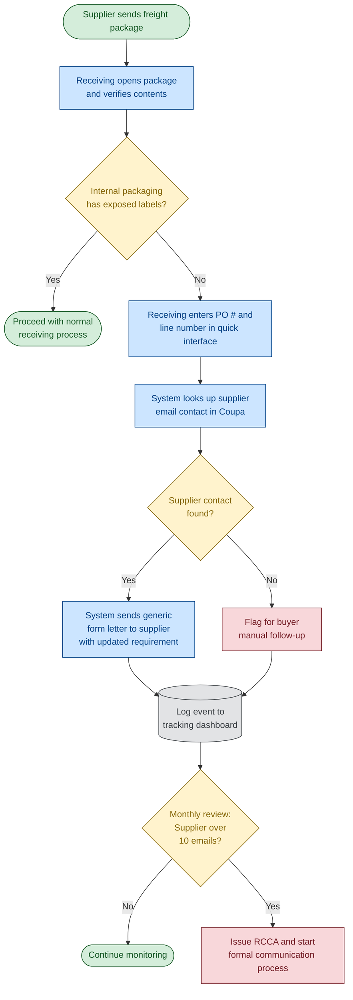

# Supplier Labeling Non-Compliance Notification Process

This flowchart describes the proposed automation for notifying suppliers when inbound freight does not meet the packaging/labeling requirement (effective 3/13/26).

## Process Flowchart

## Key Steps

| # | Step | Owner | System |
|---|------|-------|--------|
| 1 | Open freight and verify labeling | Receiving | — |
| 2 | Enter PO # + line number for non-compliant packages | Receiving | Quick interface (new) |
| 3 | Look up supplier contact | Automated | Coupa |
| 4 | Send form letter with updated requirement | Automated | Email |
| 5 | Log event | Automated | Dashboard |
| 6 | Monthly threshold review (>10 emails) | Supply Chain / Quality | Dashboard |
| 7 | Issue RCCA and formal escalation | Supply Chain / Quality | Existing RCCA process |

## Notes

- Packaging/labeling standard change effective **3/13/26**; Coupa banner already directs suppliers to updated instructions.
- Goal is to empower the receiving team to act in the moment without waiting on buyers.
- Dashboard threshold (10 emails/month) is the proposed trigger for formal RCCA escalation.
